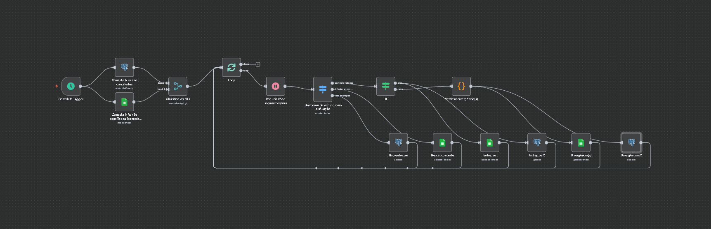

# 📑 Conciliação Automatizada de Notas Fiscais

 

## 🎯 Objetivo

Automatizar a conferência e validação de notas fiscais, garantindo consistência entre a **fonte interna (ERP, aqui simulado com o PostgreSQL)** e informações fornecidas por **fontes externas (ex.: transportadoras, marketplaces)**. Dessa forma, elimina-se a necessidade de conferências manuais, reduzindo erros e acelerando o processo de auditoria.

 

## 📌 Visão Geral

Este fluxo desenvolvido no **n8n** realiza a **conciliação automatizada de notas fiscais**. Ele compara dados de duas fontes:

* **Fonte interna (ERP)**: Simulada por um banco de dados **PostgreSQL**, representando o sistema de gestão que emite as notas fiscais.
* **Fonte externa**: Representa qualquer parceiro de negócio (ex.: transportadoras, marketplaces) cujos dados são registrados em uma **planilha do Google Sheets**.

🔍 Ao cruzar as informações, o fluxo identifica e classifica automaticamente o status de **cada nota fiscal e de cada produto**, oferecendo uma visão clara e imediata da situação de cada entrega.

 

## ⚙️ Como Funciona

O fluxo de trabalho é acionado por um **gatilho** e executa uma sequência lógica para cada nova nota fiscal a ser conferida:

1. **Gatilho**: A automação é iniciada automaticamente por um **Schedule Trigger**, configurado para executar a cada 30 minutos (ou conforme necessidade), verificando novas notas fiscais a serem processadas.
2. **Consulta ao ERP**: O fluxo consulta a **fonte interna (ERP, simulada por PostgreSQL)** para localizar a nota correspondente emitida pelo sistema de gestão.
3. **Comparação de Dados**: Os dados da **fonte interna (ERP)** e da **fonte externa (ex.: transportadora)** são comparados de forma detalhada. A automação verifica qualquer valor presente na nota fiscal, como **CNPJ, peso, valor total e impostos** (ICMS, PIS, COFINS), conforme a necessidade.
4. **Classificação de Status**:

   * **Status por produto:**

     * ✅ **Entregue**: Produto com dados consistentes entre as fontes.
     * ❌ **Não entregue**: Produto emitido no ERP, mas não encontrado nos registros da fonte externa.
     * ⚠️ **Divergência de valores**: Produto encontrado em ambas as bases, mas com diferença em valores, impostos ou peso.
   * **Status por nota fiscal:**

     * 📄 **NF não encontrada**: Nota presente nos registros da fonte externa, mas inexistente na fonte interna (ERP).
5. **Atualização Automática**: O resultado da conciliação é registrado automaticamente tanto na **simulação da fonte interna (PostgreSQL)** quanto na **planilha do Google Sheets**, mantendo ambas sincronizadas.

 

## 🚀 Funcionalidades

* **Conferência Automatizada**: Garante precisão e eficiência na validação dos dados entre as fontes.
* **Redução do Tempo de Conciliação**: O processamento automático e em larga escala diminui significativamente o tempo necessário para o processo de conferência.
* **Alta Precisão**: O fluxo assegura a integridade fiscal ao eliminar o risco de erros manuais.
* **Visibilidade Imediata**: Proporciona uma visão instantânea do status de cada nota fiscal e produto.
* **Escalabilidade e Adaptabilidade**: A lógica modular da automação se ajusta facilmente a diferentes volumes de dados e pode ser conectada a outros sistemas (**ERP, CRMs**) e bancos de dados (**MySQL, SQL Server**).

 

## 🔗 Integração com Outros Fluxos

A integração deste fluxo com o de **[Processamento Automatizado de Múltiplos Arquivos XML](https://github.com/LRLeite/Automations/tree/main/Process%20multiple%20XMLs%20files)** cria uma **solução de ponta a ponta** para a gestão completa do processo.

### Fluxos Integrados:

* Extração de Dados de XML para o Google Sheets → Processa as notas fiscais (XML) enviadas por parceiros externos (ex.: transportadora) e registra as informações numa planilha de conferência.
* Conciliação Automatizada de Notas Fiscais → Realiza a conciliação automática das notas fiscais, comparando dados da fonte externa com a fonte interna (ERP) e classificando os respectivos status.

A sinergia dessas automações permite uma solução completa, desde a entrada dos **XMLs do parceiro externo** até a **conciliação com os registros internos do ERP**.

 

## 🌟 Impacto

* **Agilidade na auditoria e logística**, com informações em tempo real.
* Maior **segurança e confiabilidade** nos registros fiscais.
* **Economia de tempo e recursos**, liberando a equipe para atividades estratégicas.
* **Redução de erros manuais** na conferência de notas fiscais.
