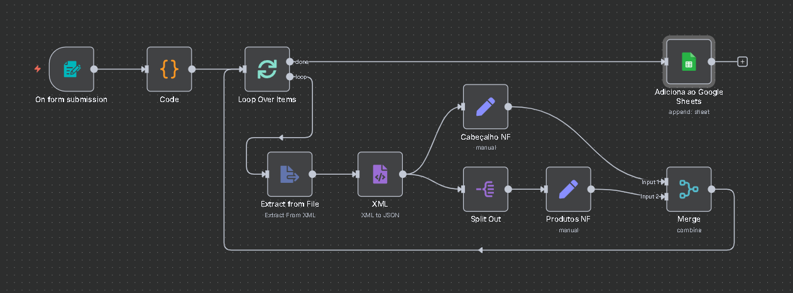

# 📂 Processamento Automatizado de Múltiplos Arquivos XML

### Este projeto apresenta um **workflow desenvolvido em n8n** para processar múltiplos arquivos XML de forma automatizada, flexível e escalável. 
### O objetivo é **extrair informações estruturadas de Notas Fiscais Eletrônicas (NFe) em XML** e armazená-las em uma planilha do **Google Sheets** de maneira organizada.

 

## 🚀 O que esta solução proporciona?

- **Upload de múltiplos arquivos XML** via formulário.
- **Processamento em lote**, garantindo que cada arquivo seja tratado individualmente.
- **Extração estruturada** dos principais dados fiscais:
  - Número da NF (`n_nf`)
  - Data de emissão (`data_emissao`)
  - CNPJ do emitente
  - CPF do destinatário
  - Produtos (EAN, descrição, valor, tributos associados)
- **Transformação de dados** (formatação de datas, substituição de separadores decimais, normalização de campos).
- **Armazenamento automático** em uma planilha do Google Sheets já integrada ao fluxo.
- **Flexibilidade** para adaptar a extração a diferentes formatos de XML ou armazenar os dados em outros sistemas.

 

## 🧩 Como funciona o fluxo

O workflow é composto por uma sequência de nós que tratam cada etapa do processo:

1. **Form Trigger** → Usuário faz upload de um ou mais arquivos XML.  
2. **Code Node** → Percorre os arquivos binários enviados e os prepara para o processamento.  
3. **Loop Over Items** → Garante que cada XML seja tratado individualmente em um loop.  
4. **Extract from File + XML** → Extrai o conteúdo do XML e converte para JSON.  
5. **Cabeçalho NF (Set Node)** → Extrai informações do cabeçalho da nota fiscal (número, data, CNPJ, CPF).  
6. **Split Out** → Separa os itens da nota (produtos).  
7. **Produtos NF (Set Node)** → Extrai informações de cada produto (código, EAN, descrição, valor, ICMS, PIS, COFINS).  
8. **Merge** → Combina os dados do cabeçalho com os itens da nota.  
9. **Google Sheets** → Insere as informações em uma planilha já configurada.  

 

## 📊 Estrutura da saída no Google Sheets

A planilha final conterá as seguintes colunas:

| n_nf | data_emissao | cnpj_emitente | cpf_destinatario | ean | produto | valor | icms | pis | cofins |
|------|--------------|---------------|------------------|-----|---------|-------|------|-----|--------|

 

## 🌟 Potencialidades e Flexibilidade

- **Multi-input**: suporta múltiplos arquivos XML em uma única execução.  
- **Escalável**: pode ser facilmente adaptado para salvar em **bancos de dados SQL, NoSQL ou sistemas ERP**.  
- **Customizável**: novos campos podem ser extraídos ajustando apenas os nós **Set** e **Merge**.  
- **Automatizável**: pode ser integrado com gatilhos automáticos como **e-mail, S3, FTP ou APIs externas**.  
- **Auditável**: o armazenamento no Google Sheets facilita consultas rápidas e exportação para análises posteriores.

